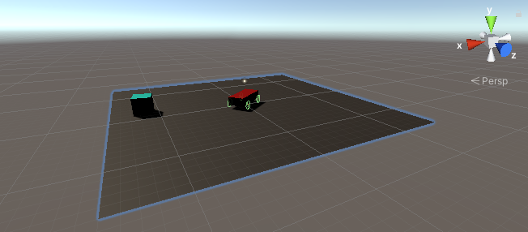

# Learning To Drive



This is the code repo to accompany the Learning to Drive series of blog posts.

  1. Learning to Drive (ReachTarget agent): [blog](http://auro.ai/blog/2020/05/learning-to-drive/) | [code](./Assets/ReachTarget)

Code was developed in Unity 2019.3.4 using ML-Agents Beta 0.15.1. It is provided here for informational purposes with no warrants of any kind. Feel free to experiment, enjoy and let us know what you think!

---

## Get Started

Before anything else, we strongly suggest you follow the ML Agents [Installation](https://github.com/Unity-Technologies/ml-agents/blob/0.15.1/docs/Installation.md) and [Basic](https://github.com/Unity-Technologies/ml-agents/blob/0.15.1/docs/Basic-Guide.md) guides. This will help you install all the needed prerequisites and get you familiar with working with the ML-Agents Toolkit. We also suggest you have a look at the blog posts above to get an idea of what these environments are meant to achieve.

**Important:** Make sure you have checked out the 0.15.1 ML Agents release.

```bash
git clone https://github.com/Unity-Technologies/ml-agents.git -b release-0.15.1
cd ml-agents/ml-agents/ && pip install -e .
```


## Running the Examples

In the Assets folder, you can find the Unity Prefabs, Scenes and Scripts needed to reproduce the results in the above blog posts. For example, you can open the baseline `ReachTarget` scene discussed in the Learning to Drive article by going to the `Assets/ReachTarget/Scenes` folder in the Unity **Project** window and opening the `ReachTarget_0` scene.

Note that the pretrained models are not included here and are left as an exercise for the reader. To train the model, first open a terminal, navigate to this project and run

```
mlagents-learn config/trainer_config.yaml --run-id=reach-target-0 --train
```

Then, with the `ReachTarget_0` scene open, press Play in the Unity Editor. If all goes well, this should start the training process.

The [trainer_config](./config/trainer_config.yaml) file defines the hyperparameters for each of the scenes. If you want to change the learning rate for the `ReachTarget_0` agent, for instance, you can do so in this file.

Once the training is complete, a `.nn` file will be saved in a `models` directory under the `run-id` that you passed as an argument to `mlagents-learn`. By dragging this model into the Unity editor, you can attach it to the agent to play it in inference mode. With the `ReachTarget` scenes, you do this by going to the Hierarchy window and opening `GameObject/ReachTargetPlatform` and selecting the `Agent` prefab. With the `Agent` selected, you should now see an Inspector panel filled with a number of components. Find the component labeled **Behavior Parameters** and drag your `.nn` model into the `Model` field. Now, when you press Play, the agent should run using the learned model.
